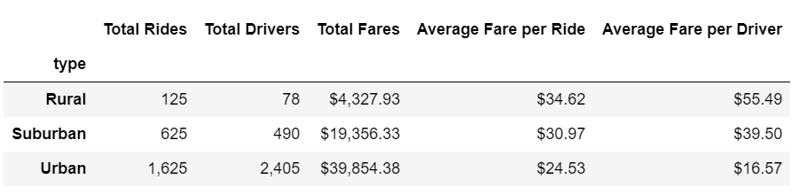
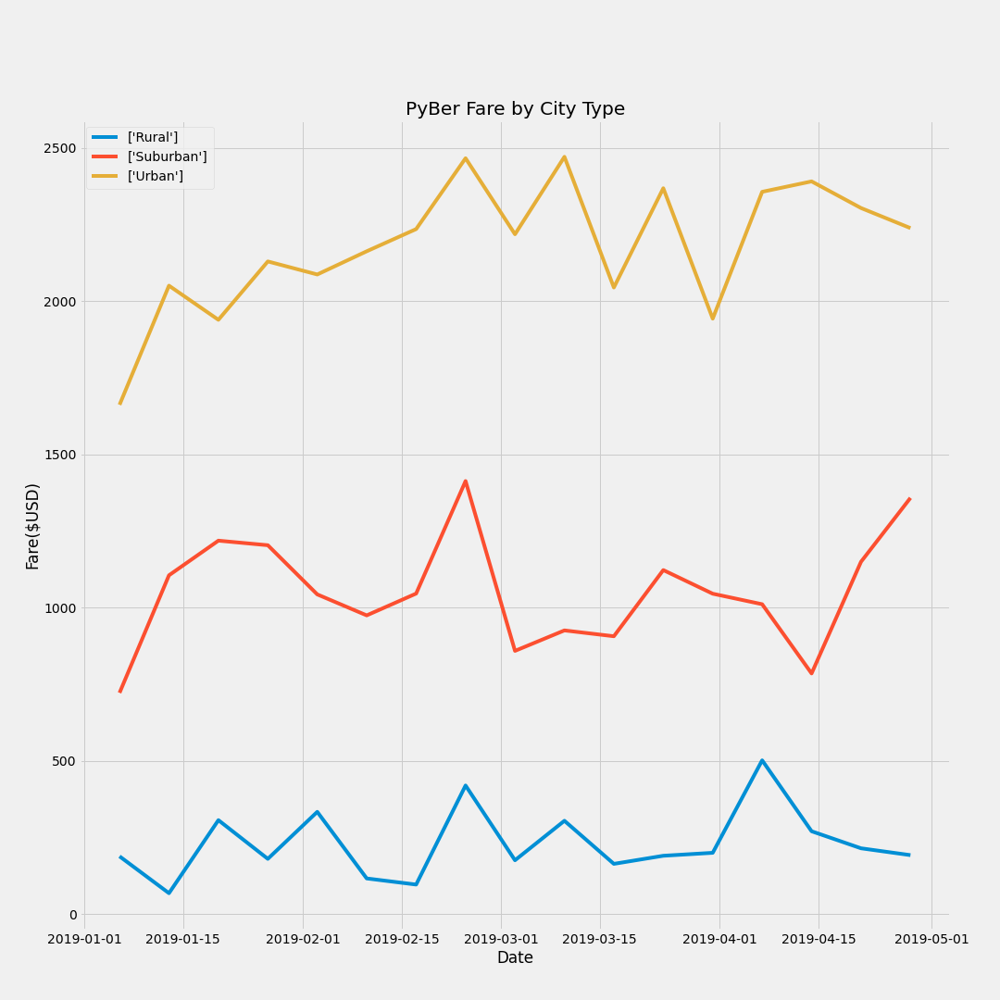

# PyBer_Analysis

1.1 Describe the purpose, or the reason, you did this assignment.
The purpose of the assignment is to analyze data from two datasources and make it more readable and transparent.
1.2 How did you analyze the data to create the technical deliverables?
To create Summary Dataframe I used groupby() function on the city type.
I"ve calculated "Average Fare per Ride" and	"Average Fare per Driver".
1.3 What can be said about the summary DataFrame and multiple-line graph with respect to the ride-sharing data among the different city types? Include images of the summary DataFrame table and the multiple-line graph in these results.

A short summary of the results. As shown in the Chart1, most of the rides (1,625 USD, or 68.4%) and revenue (39,854 USD or 62.7%) are generated in the "Urban" City type, and the least in Rural - 125 or 5.3% of total rides and 4,327 USD. or 6.8% of revenue.
Avarage Fare per Ride and Average Fare per Driver have the highest amounts in Rural Cities.

As illustrated in the following Chart2, in terms of Revenue contribution, "Urban City" brings up to 2.5 th USD weekly, while maximum weekly revenue from "Suburban" was 1.4 th USD, and just up to 0.5 th USD from Rural Cities. While Revenue is increaasing from January vs February, it can be an indication that business has seasonal impact.

2. What challenges or difficulties did you encounter? If none, then briefly explain what challenges or difficulties may be encountered and how to avoid them using technical analysis.
In the original dataframe the "Date" column did not have the right data type (object, instead of datetime) and it was a challege. The solution was to convert it into right data type.
I read the description of errors and try to find solution, reffering to the following sources:
https://pandas.pydata.org/, https://matplotlib.org/. 
Another challenge was to build a Chart. I tried to google and found some examples. After I set an x parameter as index of the dataframe, the solution was found.

3. Two additional analyses you could do to gain more insight into the data, like using other datasets.
3.1 I would recommend to analyze the contribution margin from all three categories and by drivers.
Another suggestion I have to group drivers by categories: purpose of the trip (business, leisure), distance of the trip, etc.
I would create a dataset with contribution margin by driver (customer) and by categories of drivers (customers).
It can be shown on the Pie Chart, the contribution, or gross margin generated by each category of cutomers. 

3.2 It would be useful to cover the entire year, so I recommend to generate the report with the data for the twelve month and compare with the previous year.
